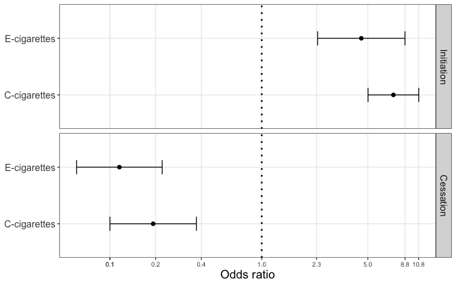

Introduction
============

This vignette is provided to run the models described in the paper “A
joint polytomous logistic regression model for the initiation and
cessation of electronic cigarettes and conventional cigarettes with
time-dependent covariates in a longitudinal study”.

Methods
=======

Simulating data
---------------

``` r
source("model_functions.R")
# Parameter specifications 
nT <- 5 # number of time points (including the baseline)
V <- 4 # number of covariates
N <- 1000

simstat <- Initiate(nT=nT, V=V)
set.seed(2020)
sData <- SimulateData(param=simstat, N=N)

X <- sData[["X"]]
Y <- sData[["Y"]]
```

Data overview
-------------

`simstat` is a list containing parameters like *λ*s, *μ*s, *α*s, *η*s,
*β*s, *γ*s, and *δ*s.

``` r
simstat
```

    $lambda
         [,1] [,2] [,3] [,4] [,5]
    [1,]   NA   -2   -2   -2   -2
    [2,]   NA   -3   -3   -3   -3

    $mu
         [,1] [,2] [,3] [,4] [,5]
    [1,]   NA    1    1    1    1
    [2,]   NA    2    2    2    2

    $alpha
         [,1] [,2] [,3] [,4]
    [1,]  0.3  0.1  0.1  0.1
    [2,]  0.3  0.3  0.1  0.3

    $eta
         [,1] [,2] [,3] [,4]
    [1,] -0.1 -0.1 -0.1 -0.1
    [2,] -0.2 -0.2 -0.2 -0.2

    $beta
    [1] 2 2

    $gamma
    [1] -2 -2

    $delta
         [,1] [,2]
    [1,]    0    0
    [2,]    0    0

`X` is a list of `N` matrices of nT × V, each of which contains `V`
covariates over `nT` time points for one observation.

``` r
head(X, n = 2)
```

    [[1]]
               [,1]          [,2]         [,3]       [,4]
    [1,] -0.2767545 -0.2949347331  0.389957977 -1.0959907
    [2,] -0.1768179 -0.2057567667  0.185015015 -0.9887932
    [3,] -0.2508131 -0.2021924343 -0.005899663 -0.4741751
    [4,] -0.4995336 -0.0006096089 -0.190396962 -0.5540971
    [5,]  0.1635396  0.3973435305  0.033122267  0.2105109

    [[2]]
                [,1]         [,2]       [,3]       [,4]
    [1,] -0.06983043  0.115383532 0.21506862 -0.9518591
    [2,] -0.17221585 -0.201101530 0.05431437 -0.8657853
    [3,]  0.01302561 -0.198498831 0.13416215 -0.6919490
    [4,] -0.01232931  0.002671777 0.15355087 -0.5217994
    [5,]  0.07178421  0.282679259 0.50660175 -0.2592659

`Y` is a list of `N` matrices of nT × V, each of which contains two
outcomes (0: No; 1: Yes) over `nT` time points for one observation.

``` r
head(Y, n = 2)
```

    [[1]]
         [,1] [,2]
    [1,]    0    0
    [2,]    0    0
    [3,]    0    0
    [4,]    0    0
    [5,]    0    0

    [[2]]
         [,1] [,2]
    [1,]    0    0
    [2,]    0    0
    [3,]    0    1
    [4,]    1    0
    [5,]    0    0

Running the joint polytomous logistic regression models
-------------------------------------------------------

``` r
#res_joint <- Analyze(simstat, X, Y)
load("results.rdata")
```

Results
=======

The model yields the coefficients and standard errors of all parameters
listed by `simstat`.

``` r
# coefficients 
coef_joint <- vec2list(res_joint$par)
# standard errors 
sigma_joint <- vec2list(sqrt(diag(solve(-res_joint$hessian))))
# create 95% CI plots 

head(coef_joint, n=2)
```

    $lambda
         [,1]      [,2]      [,3]      [,4]      [,5]
    [1,]   NA -1.969336 -2.031680 -1.887466 -2.098677
    [2,]   NA -2.964486 -3.091678 -3.007822 -2.839381

    $mu
         [,1]     [,2]     [,3]     [,4]     [,5]
    [1,]   NA 1.290218 0.780491 1.088544 1.158296
    [2,]   NA 1.515351 1.471450 1.528144 1.757900

``` r
head(sigma_joint, n=2)
```

    $lambda
         [,1]      [,2]      [,3]      [,4]      [,5]
    [1,]   NA 0.1044587 0.1077947 0.1041738 0.1123711
    [2,]   NA 0.1403005 0.1472668 0.1424860 0.1356227

    $mu
         [,1]      [,2]      [,3]      [,4]      [,5]
    [1,]   NA 0.2205268 0.1849230 0.1791407 0.1813348
    [2,]   NA 0.4192058 0.3364667 0.3307288 0.3304476

We displayed the odds ratio plots for important variables *β*s and *γ*s.

``` r
df <- data.frame(type = factor(
                   rep(c("Initiation", "Cessation"), each = 2), 
                   levels = c("Initiation", "Cessation")
                 ),
                 cig = c("E-cigarettes", "C-cigarettes", 
                         "E-cigarettes", "C-cigarettes"),
                 mean = c(coef_joint$beta,
                          coef_joint$gamma), 
                 sd = c(sigma_joint$beta,
                        sigma_joint$gamma))

df$lb <- exp(df$mean + qnorm(0.025)*df$sd)
df$ub <- exp(df$mean + qnorm(0.975)*df$sd)
df$mean <- exp(df$mean)

ggplot(df, aes(x = cig, y = mean)) +
  geom_point(position=position_dodge(width=0.3), size=2) +
  geom_hline(yintercept = 1.0, linetype="dotted", size=1) + 
  scale_y_continuous(trans='log2', 
                     breaks = c(round(df$lb, 1), 
                                round(df$ub, 1), 1)) +
  scale_color_manual(values = c("grey", "black")) +
  guides(color = guide_legend(reverse = TRUE)) +
  geom_errorbar(aes(ymin = lb, ymax = ub),
                position = position_dodge(0.3), width = 0.25) +
  facet_grid(type~.)+
  coord_flip() +
  ylab("Odds ratio") +
  theme_bw()+
  theme(text = element_text(size=15),
        axis.text.x = element_text(size=8),
        panel.grid.minor = element_blank(),
        legend.position = "top", 
        legend.title = element_blank(), 
        axis.title.y = element_blank())
```


