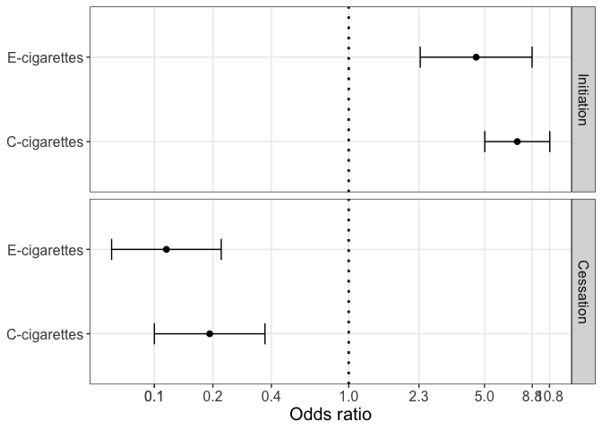

Introduction
============

This vigenette is provided to run the models described in the paper “A
joint polytomous logistic regression model for the initiation and
cessation of electronic cigarettes and conventional cigarettes with
time-dependent covariates in a longitudinal study”.

Methods
=======

Simulating data
---------------

``` r
source("model_functions.R")
# Parameter specifications 
nT <- 5 # number of time points (including the baseline)
V <- 4 # number of covariates
N <- 1000

simstat <- Initiate(nT=nT, V=V)
sData <- SimulateData(param=simstat, N=N)

X <- sData[["X"]]
Y <- sData[["Y"]]
```

Running the joint polytomous logistic regression models
-------------------------------------------------------

``` r
#res_joint <- Analyze(simstat, X, Y)
load("results.rdata")
```

Results
=======

``` r
# coefficients 
coef_joint <- vec2list(res_joint$par)
# standard errors 
sigma_joint <- vec2list(sqrt(diag(solve(-res_joint$hessian))))
# create 95% CI plots 

df <- data.frame(type = factor(
                   rep(c("Initiation", "Cessation"), each = 2), 
                   levels = c("Initiation", "Cessation")
                 ),
                 cig = c("E-cigarettes", "C-cigarettes", 
                         "E-cigarettes", "C-cigarettes"),
                 mean = c(coef_joint$beta,
                          coef_joint$gamma), 
                 sd = c(sigma_joint$beta,
                        sigma_joint$gamma))

df$lb <- exp(df$mean + qnorm(0.025)*df$sd)
df$ub <- exp(df$mean + qnorm(0.975)*df$sd)
df$mean <- exp(df$mean)

ggplot(df, aes(x = cig, y = mean)) +
  geom_point(position=position_dodge(width=0.3), size=2) +
  geom_hline(yintercept = 1.0, linetype="dotted", size=1) + 
  scale_y_continuous(trans='log2', 
                     breaks = c(round(df$lb, 1), 
                                round(df$ub, 1), 1)) +
  scale_color_manual(values = c("grey", "black")) +
  guides(color = guide_legend(reverse = TRUE)) +
  geom_errorbar(aes(ymin = lb, ymax = ub),
                position = position_dodge(0.3), width = 0.25) +
  facet_grid(type~.)+
  coord_flip() +
  ylab("Odds ratio") +
  theme_bw()+
  theme(text = element_text(size=15),
        panel.grid.minor = element_blank(),
        legend.position = "top", 
        legend.title = element_blank(), 
        axis.title.y = element_blank())
```


